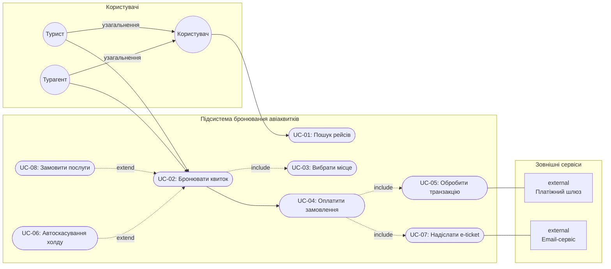

### 2. `README.md` (Огляд та Use Case діаграма)

# Система бронювання авіаквитків — Вимоги та Use Cases

Цей репозиторій містить вимоги, специфіковані за синтаксисом EARS, User Stories із Gherkin-сценаріями, матрицю трасування та Use Case діаграму в межах виконання Завдання 2.

---

## 1. Діаграма прецедентів (Use Case Diagram)

Діаграма демонструє:
* **Генералізацію акторів**: `Tourist` та `Agent` є нащадками загального `User`.
* **Вторинних акторів**: `Payment Gateway` та `Notification Service`.
* **Обов'язкові зв'язки `<<include>>`**: `Бронювати квиток` обов'язково включає `Вибрати місце`.
* **Умовні зв'язки `<<extend>>`**: `Замовити додаткові послуги` опціонально розширює базовий процес бронювання; `Автоскасування за таймаутом` розширює замовлення при вичерпанні 15 хв.

