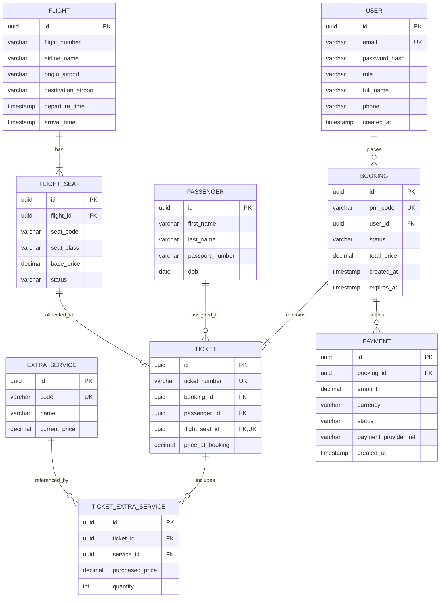

# Система бронювання авіаквитків - домен і модель даних (ER)

Даний репозиторій містить опис даних обраного домену як моделі сутностей і зв'язків. 

## 1. Опис предметної області
Система автоматизує взаємодію між туристами, агентами та авіакомпаніями (пошук рейсів, вибір додаткових послуг, бронювання, можливість зворотного зв'язку та оплата.).

## 2. Логічна ER-модель (v4, нормалізація до 3НФ)
