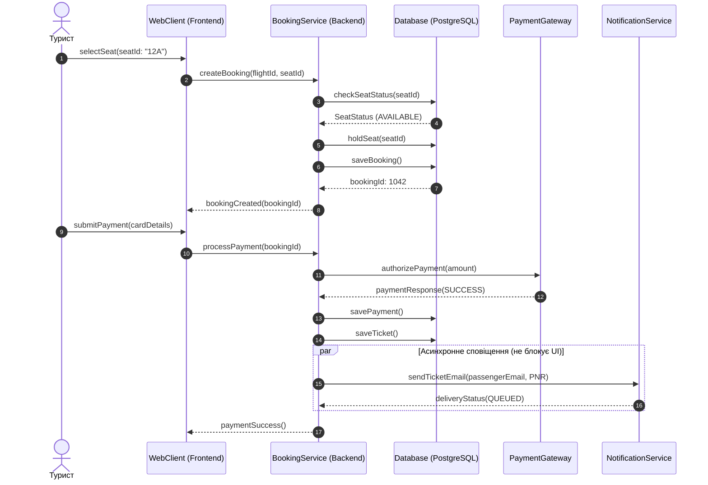

# Система бронювання авіаквитків - Взаємодія (Sequence Diagram)

```mermaid
sequenceDiagram
    autonumber
    actor Tourist as Турист
    participant UI as WebClient (Frontend)
    participant API as BookingService (Backend)
    participant DB as Database (PostgreSQL)
    participant Bank as PaymentGateway
    participant Email as NotificationService

    Tourist->>UI: selectSeat(seatId: "12A")
    UI->>API: createBooking(flightId, seatId)
    API->>DB: checkSeatStatus(seatId)
    DB-->>API: SeatStatus (AVAILABLE)
    API->>DB: holdSeat(seatId)
    API->>DB: saveBooking()
    DB-->>API: bookingId: 1042
    API-->>UI: bookingCreated(bookingId)

    Tourist->>UI: submitPayment(cardDetails)
    UI->>API: processPayment(bookingId)
    API->>Bank: authorizePayment(amount)
    Bank-->>API: paymentResponse(SUCCESS)
    
    API->>DB: savePayment()
    API->>DB: saveTicket()
    
    par Асинхронне сповіщення (не блокує UI)
        API->>Email: sendTicketEmail(passengerEmail, PNR)
        Email-->>API: deliveryStatus(QUEUED)
    end
    
    API-->>UI: paymentSuccess()
```